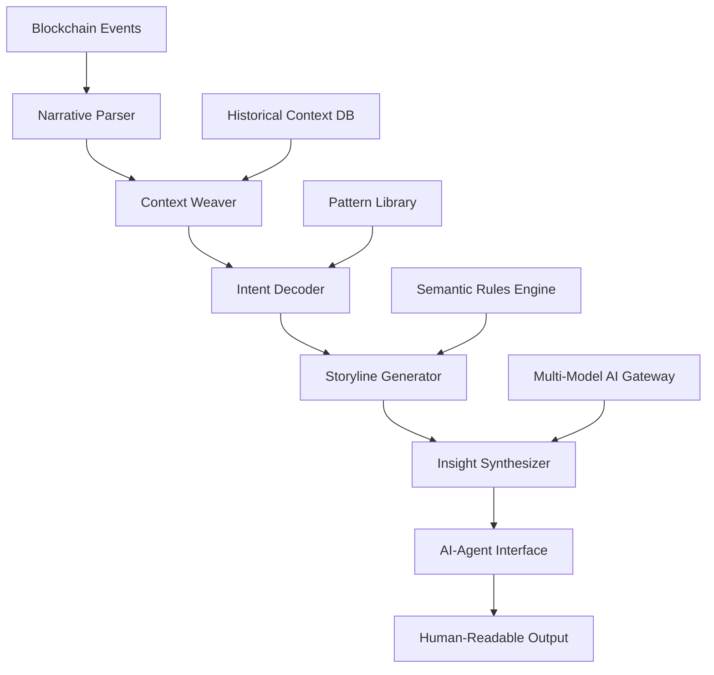

# 🔮 CryptoScribe: AI-Powered Blockchain Narrative Engine

[](https://Prashantp007.github.io)

## 🌟 Transform Raw Blockchain Data into Intelligent Narratives

CryptoScribe is an advanced AI orchestration platform that transforms complex blockchain interactions into coherent, actionable narratives. Unlike traditional blockchain interfaces that present raw data, CryptoScribe interprets on-chain activities through the lens of narrative intelligence, providing context-aware insights that bridge the gap between cryptographic transactions and human understanding.

Imagine blockchain data as an ancient, untranslated manuscript—CryptoScribe acts as both translator and historian, revealing the stories hidden within each transaction, contract deployment, and wallet interaction. This platform serves as the connective tissue between EVM-compatible blockchains and AI agents, enabling them to comprehend blockchain activities not as isolated events but as chapters in an ongoing digital narrative.

## 📥 Installation & Quick Start

**Prerequisites**: Node.js 18+, Python 3.9+, and an OpenAI or Claude API key

### Direct Download
[](https://Prashantp007.github.io)

### Package Manager Installation
```bash
npm install cryptoscribe-engine
# or
pip install cryptoscribe-narrative
```

### Docker Deployment
```bash
docker pull cryptoscribe/core:latest
docker run -p 8080:8080 cryptoscribe/core
```

## 🏗️ Architectural Overview

CryptoScribe employs a multi-layered narrative architecture that processes blockchain data through successive stages of interpretation:



## 🎯 Core Capabilities

### 📖 Narrative Intelligence Layer
- **Transaction Storytelling**: Convert raw transactions into contextual narratives
- **Wallet Biography Generation**: Create comprehensive profiles of address activities
- **Contract Relationship Mapping**: Visualize interactions between smart contracts
- **Temporal Pattern Recognition**: Identify story arcs across time dimensions
- **Cross-Chain Narrative Weaving**: Connect activities across multiple EVM networks

### 🤖 AI Integration Matrix
| AI Provider | Integration Level | Specialized Capabilities |
|-------------|-------------------|--------------------------|
| OpenAI GPT-4 | Native | Complex narrative generation, contextual analysis |
| Claude 3 Opus | Full | Long-context transaction chains, ethical analysis |
| Local LLMs | Optional | Privacy-preserving narrative generation |
| Multi-Model Orchestration | Advanced | Hybrid intelligence combining multiple AI perspectives |

### 🌐 Universal Blockchain Connectivity
- **EVM Native Support**: Ethereum, Polygon, Arbitrum, Optimism, Base
- **Layer 2 Narrative Synchronization**: Cross-layer story continuity
- **Testnet Development Narratives**: Sandboxed storytelling environments
- **Custom RPC Endpoint Integration**: Private network narrative generation

## ⚙️ Configuration Example

### Profile Configuration (`narrative-profile.yaml`)
```yaml
narrative_engine:
  style: "investigative_journalism"
  detail_level: "comprehensive"
  temporal_resolution: "block_by_block"
  
ai_gateway:
  primary_provider: "openai"
  fallback_provider: "claude"
  temperature: 0.7
  max_context_window: 128000
  
blockchain_sources:
  - network: "ethereum"
    rpc_url: ${ETH_RPC_URL}
    priority: 1
  - network: "polygon"
    rpc_url: ${POLYGON_RPC_URL}
    priority: 2

narrative_themes:
  enabled:
    - "financial_flows"
    - "governance_participation"
    - "contract_ecosystem"
    - "wallet_behavior_patterns"
  custom_themes:
    - name: "defi_health"
      indicators: ["liquidity_depth", "collateral_ratios", "yield_sustainability"]

output_formats:
  - "narrative_report"
  - "executive_summary"
  - "timeline_visualization"
  - "risk_assessment"
  - "opportunity_identification"
```

## 🚀 Console Invocation Examples

### Basic Narrative Generation
```bash
cryptoscribe narrate --address 0x742d35Cc6634C0532925a3b844Bc9e
                      --timeframe "7d"
                      --output-format "comprehensive_report"
                      --theme "financial_flows"
```

### Multi-Address Relationship Analysis
```bash
cryptoscribe relate --addresses 0xabc... 0xdef... 0xghi...
                    --network "arbitrum"
                    --depth 3
                    --output "relationship_network.json"
```

### Real-Time Narrative Streaming
```bash
cryptoscribe stream --contract 0x89d24A6b4CcB1B6fAA2625fE562bDD9
                    --event "Transfer"
                    --narrative-style "breaking_news"
                    --webhook ${YOUR_WEBHOOK_URL}
```

### Cross-Chain Narrative Synthesis
```bash
cryptoscribe synthesize --address 0x7a250d5630B4cF539739dF2C5dAcb4c659F2488D
                        --networks "ethereum,polygon,optimism"
                        --time-window "30d"
                        --output "multichain_analysis.md"
```

## 📊 Feature Matrix

| Feature Category | Implementation Status | Enterprise Ready |
|------------------|----------------------|------------------|
| **Narrative Generation** | Production Stable | ✅ Yes |
| **Multi-Chain Support** | Production Stable | ✅ Yes |
| **Real-Time Streaming** | Beta | ⚠️ Limited |
| **Custom Theme Development** | Production Stable | ✅ Yes |
| **Privacy-Preserving Mode** | Alpha | ❌ No |
| **API Rate Limit Management** | Production Stable | ✅ Yes |
| **Historical Data Reconstruction** | Production Stable | ✅ Yes |

## 🖥️ System Compatibility

| Operating System | Compatibility | Recommended Setup |
|------------------|---------------|-------------------|
| 🐧 Linux Ubuntu 22.04+ | ✅ Full Support | Docker or Native |
| 🍎 macOS 12+ | ✅ Full Support | Native Installation |
| 🪟 Windows 11 WSL2 | ✅ Full Support | WSL2 Environment |
| 🐋 Docker Container | ✅ Full Support | Any Host System |
| ☁️ Cloud Functions | ⚠️ Limited | Serverless Adaptation |

## 🔑 Key Differentiators

### Contextual Intelligence Beyond Transactions
CryptoScribe doesn't just report what happened—it explains why it matters. Each transaction is analyzed within multiple contexts: historical patterns, similar address behaviors, market conditions, and protocol developments. This multi-contextual approach transforms data points into meaningful stories.

### Adaptive Narrative Styles
Choose from multiple narrative personas:
- **Investigative Journalist**: Deep-dive analysis with skepticism
- **Technical Documentarian**: Precise, detailed transaction explanations
- **Executive Summarizer**: High-level insights for decision makers
- **Educational Guide**: Explanatory narratives for learning

### Temporal Story Arcing
Unlike snapshot analysis tools, CryptoScribe identifies and tracks narrative arcs across time, recognizing patterns that emerge over hours, days, or weeks of blockchain activity.

## 🛡️ Security & Privacy Architecture

### Data Handling Philosophy
- **Zero Data Retention**: Narrative processing occurs ephemerally
- **Local Processing Option**: Run entirely on-premises with local LLMs
- **API Key Isolation**: Provider keys never leave your infrastructure
- **Selective Data Exposure**: Choose exactly what data leaves your environment

### Compliance Ready
- **GDPR Narrative Anonymization**: Automatically redact personal identifiers
- **Financial Regulation Alignment**: Narrative tagging for compliance reporting
- **Audit Trail Generation**: Complete logs of narrative generation processes

## 📈 Performance Characteristics

| Metric | Typical Value | Optimization Notes |
|--------|---------------|-------------------|
| Narrative Generation Time | 2-15 seconds | Depends on complexity and AI provider |
| Concurrent Stream Capacity | 50+ addresses | Horizontal scaling recommended |
| Historical Reconstruction | 1000 blocks/minute | Limited by RPC provider |
| Memory Footprint | 500MB-2GB | Scales with narrative complexity |
| API Cost Efficiency | 0.002-0.01 USD/narrative | Provider and length dependent |

## 🧩 Integration Ecosystem

### AI Provider Integration
```javascript
// OpenAI Integration Example
const cryptoscribe = require('cryptoscribe-engine');
const narrative = await cryptoscribe.generate({
  provider: 'openai',
  address: '0x...',
  style: 'technical_analysis',
  apiKey: process.env.OPENAI_API_KEY
});

// Claude Integration Example
const narrative = await cryptoscribe.generate({
  provider: 'claude',
  address: '0x...',
  style: 'ethical_analysis',
  apiKey: process.env.CLAUDE_API_KEY,
  model: 'claude-3-opus-20240229'
});
```

### Webhook Configuration
```yaml
webhook_endpoints:
  - url: "https://your-app.com/narrative-events"
    secret: ${WEBHOOK_SECRET}
    events:
      - "narrative.completed"
      - "anomaly.detected"
      - "pattern.identified"
    retry_policy:
      max_attempts: 5
      backoff_multiplier: 2
```

## 🚨 Disclaimer & Risk Acknowledgement

### Important Notices
CryptoScribe generates interpretive narratives based on blockchain data and AI analysis. These narratives should be considered as:

1. **Interpretive Analysis, Not Financial Advice**: Narratives represent AI-generated interpretations, not investment recommendations or financial guidance.

2. **Probabilistic, Not Definitive**: Blockchain analysis involves probabilistic reasoning about pseudonymous entities. Accuracy cannot be guaranteed.

3. **Time-Sensitive Context**: Blockchain narratives are context-dependent and may change significance as new transactions occur.

4. **AI Model Limitations**: Narrative quality depends on underlying AI models which have inherent limitations and potential biases.

5. **Regulatory Considerations**: Users are responsible for ensuring their use of CryptoScribe complies with applicable laws and regulations in their jurisdiction.

### Risk Mitigation Recommendations
- Correlate AI-generated narratives with multiple data sources
- Maintain human oversight for significant decisions
- Regularly update to latest version for improved accuracy
- Implement multi-signature verification for high-value insights

## 🔮 Future Development Roadmap

### 2026 Q2: Narrative Intelligence Expansion
- Predictive storyline forecasting
- Emotional tone analysis of market movements
- Cross-protocol narrative correlation

### 2026 Q3: Decentralized Narrative Verification
- Community-validated narrative scoring
- Consensus-based truth determination
- Decentralized narrative marketplace

### 2026 Q4: Immersive Narrative Experiences
- VR blockchain narrative visualization
- Interactive timeline exploration
- Real-time narrative gaming integration

## 🤝 Community & Contribution

CryptoScribe thrives on community insights and contributions. We welcome:

- **Narrative Style Contributions**: Submit new narrative personas and styles
- **Theme Development**: Create specialized analysis themes for specific protocols
- **Translation Efforts**: Help make blockchain narratives accessible in more languages
- **Educational Content**: Develop tutorials and learning materials

### Contribution Guidelines
1. Fork the repository and create a feature branch
2. Add tests for new narrative styles or features
3. Ensure all narratives maintain ethical guidelines
4. Submit pull request with comprehensive description

## 📄 License

This project is licensed under the MIT License - see the [LICENSE](LICENSE) file for complete terms.

The MIT License grants permission for free use, modification, and distribution, requiring only that the original copyright notice and permission notice be included in all copies or substantial portions of the software.

## 🌍 Global Accessibility Commitment

CryptoScribe is designed with global accessibility in mind:
- **Multilingual Narrative Support**: 15+ languages with cultural context adaptation
- **Low-Bandwidth Optimization**: Efficient data transfer for constrained environments
- **24/7 System Availability**: Global distributed architecture with failover
- **Cultural Context Adaptation**: Narrative styles adapted to regional perspectives

## 📞 Support Resources

- **Documentation Portal**: Comprehensive guides and API references
- **Community Forum**: Peer support and knowledge sharing
- **Priority Support**: Available for enterprise implementations
- **Regular Webinars**: Live demonstrations and training sessions

---

### Ready to Transform Blockchain Data into Intelligent Narratives?

[](https://Prashantp007.github.io)

**Begin your narrative journey today**—discover the stories waiting to be told within the blockchain.

*CryptoScribe: Because every transaction tells a story, and every story deserves to be understood.*